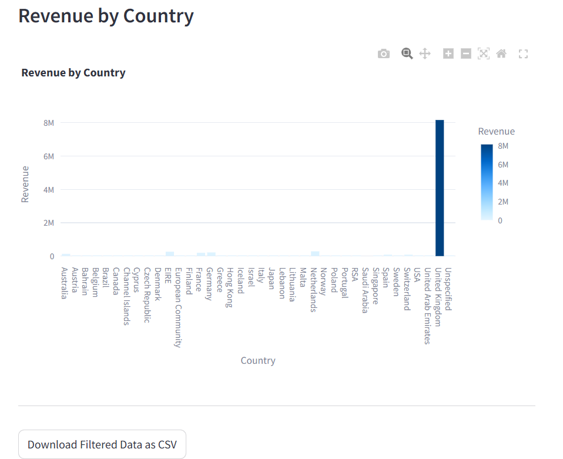
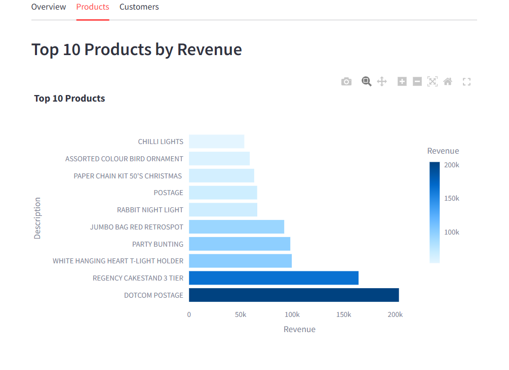
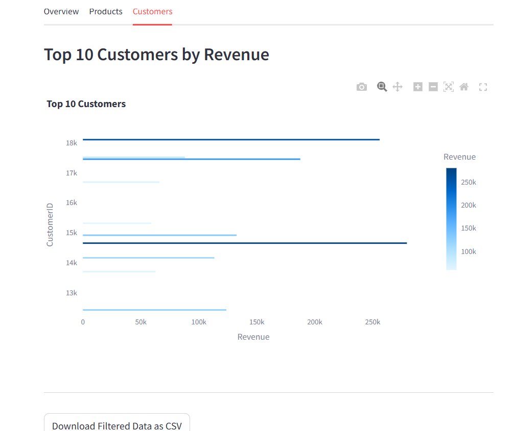

````markdown
# E-commerce Analytics Dashboard

## Overview
Interactive **E-commerce Analytics Dashboard** built with **Python, Pandas, Plotly, and Streamlit** to analyze sales, customer behavior, and product performance.  
Provides **KPIs, trends, top products, and customer insights** in an intuitive, interactive interface.

---

## Features
- **KPI Cards:** Total Revenue, Total Orders, Avg Order Value, Unique Customers  
- **Interactive Charts:** Monthly Revenue Trend, Revenue by Country, Top 10 Products, Top 10 Customers  
- **Search Products:** Safely search for any product/company  
- **Filters:** Country and date range selection  
- **Export Data:** Download filtered dataset as CSV  
- **Tabs:** Organized sections for Overview, Products, Customers

---

## Screenshots
### KPI Cards
[KPI Cards](images/kpi.png)

### Monthly Revenue Trend


### Top Products


### Top Customers


---

## Dataset
- Columns: `InvoiceNo, StockCode, Description, Quantity, InvoiceDate, UnitPrice, CustomerID, Country`  
- Revenue calculated as: `Quantity * UnitPrice`  
> Ensure the dataset CSV file is named `your_dataset.csv` in the project folder.

---

## Installation
1. Clone the repo:
```bash
git clone https://github.com/yourusername/ecommerce-dashboard.git
cd ecommerce-dashboard
````

2. Install dependencies:

```bash
pip install pandas streamlit plotly
```

3. Run the dashboard:

```bash
streamlit run ecommerce_dashboard.py
```

---

## Technologies

Python | Pandas | Streamlit | Plotly

---

## Future Enhancements

* Sales forecasting using ARIMA/Prophet
* Customer segmentation using K-Means
* Category-level heatmaps

---

## Project Outcome

* Provides actionable insights into **sales trends, product performance, and customer behavior**
* Demonstrates **data-driven decision-making skills** and **professional dashboard design** for analytics roles
